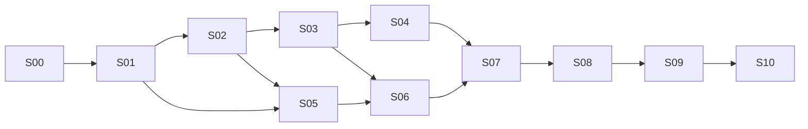

# V3.9.6 总升级实施计划

版本：DESIGN-1，2026-09-21。状态：**PLAN_ONLY / 未开始实施**。总设计：当前任务；实施工程师：terra、luna。本文及分步文件是实施规格，文件写入不代表任务完成、能力已上线或交易已获授权。

依据：[详细设计与风险评估](../../reports/v396-detailed-upgrade-and-quant-risk-assessment-20260921.md)、[最终报告](../../reports/v395-project-final-and-v396-implementation-plan-20260921.md)、[R17](../../reports/v395-final-24h-soak-and-release-baseline-20260921.md)。源码核对基线为 `4473a6f59f132eddb35fd3cca2ddf8e6fa7bdf8a`；设计报告提交为 `9caacb32c75182deda4aa805007061f096b9493d`。工程师开始时必须记录实际 base/head 与差异，不得把基线数字当作实时账户状态。

## 1. 目标与不可变规则

目标：将现有多币种系统升级为可验证的“入场计划→有限期 AI 管理→合法退出/人工交接→全周期归因→记忆反馈”系统，优先修复 46/100 评估中的证据和风险短板。

1. 用户已确认：AI 管理有效期内，论点失效时允许预计原周期净亏损 0–10 USDT 的退出；超过阈值禁止新增 AI 主动退出，转人工。10 是权限线，不是损失上限。
2. AI 可按冻结计划微盈利退出；不能自行加仓摊平、反手、增杠杆、延期或扩大风险授权。首版只请求整仓退出，部分成交由执行层处理。
3. 人工接管后零例行模型调用；私有事实、对账、账户风险和已授权 TP 维护继续。人工仓继续占用全账户风险与资本。
4. 同 `environment/account/symbol/positionSide` 只有一个执行所有权；同域禁止 AI 与人工双写。恢复盈利不能自动重获 AI 权限。
5. 模型没有交换密钥或通用下单工具；所有写仍走现有环境锁定、签名、出口闸与权限检查。
6. 未知净收益不能当 0，交接不是平仓；资金费、浮亏和人工后的结果不能从业绩中消失。
7. 遵守仓库 AGENTS：Engine 只能由用户明确要求某次生命周期动作后操作，手动启动用 `scripts/start-zdj-lan.ps1`；不得自动启停、重启、热重载或安装守护程序。
8. 本次仅交付计划。未来给工程师的代码任务不隐含部署、迁移现网数据库、改 Settings、发交易或启用 ENFORCE 的权限。

## 2. 文件入口与职责

先读本文件、[公共契约](CONTRACTS.md)、本阶段文件；测试和交付遵循[工程师运行规则](ENGINEER-RUNBOOK.md)。能力评分见[证据矩阵](ACCEPTANCE-SCORECARD.md)，向总设计交付使用[交付模板](HANDOFF-TEMPLATE.md)。无需每轮重读所有长报告。

| 阶段 | 文件 | 主实施 | luna 的有界任务 | 前置验收 |
|---|---|---|---|---|
| S00 | [基线与规格](00-baseline-and-specification.md) | terra | 文件清单、离线夹具清单与文档索引 | 无 |
| S01 | [事实、收益与观测](01-truth-accounting-observability.md) | terra | collector 纯函数、指标与测试夹具 | S00 |
| S02 | [所有权与交接](02-ownership-and-handoff.md) | terra | 状态展示/通知 outbox 夹具，接口冻结后 | S01 |
| S03 | [退出成本与权限](03-exit-cost-and-policy.md) | terra | 边界数据表与序列化测试 | S02 |
| S04 | [统一退出执行](04-exit-execution-coordination.md) | terra | 适配器模拟器的独立测试场景 | S03 |
| S05 | [组合与尾部风险](05-portfolio-and-tail-risk.md) | terra | 风险聚合展示与压力报告格式 | S01、S02 |
| S06 | [交易计划与数量期限](06-trade-plan-sizing-horizon.md) | terra | schema 示例、拒绝原因展示 | S03、S05 |
| S07 | [双模型复核与记忆](07-model-review-memory-budget.md) | terra | token 台账、检索夹具、纯展示 | S04、S06 |
| S08 | [设置、UI 与运维](08-settings-ui-operations.md) | luna，terra 复核服务端 | 主体 UI/字段映射/回读测试 | S02–S07 |
| S09 | [回放、压力与统计](09-replay-stress-statistics.md) | terra | 冻结报告生成、结果差异工具 | S01–S08 |
| S10 | [Testnet 与发布验收](10-testnet-release-acceptance.md) | terra | 只读采集与证据索引 | S09；运行写动作另需授权 |

这是后续派工建议，本轮没有启动 luna/terra 实施。总设计负责跨阶段契约、风险语义、分歧裁决和最终证据审查；实施者不得自行扩大策略权限。分配反映任务边界，不是模型能力的保证。

## 3. 执行依赖和合并顺序

依赖是集成与启用门，不禁止提前写使用冻结接口的纯函数/夹具。S05 与 S03/S04 可在接口冻结后分支开发；S08 可提前画只读页面，但不能编造已生效设置。S09 的试验预注册在 S00 完成骨架、S05/S06 参数冻结后补齐，必须先于看测试集结果。

每次仅一个工程师拥有共享契约、`settingsStore.ts` 或 `appRuntime.ts` 的写入权。按小 PR 顺序合并；不同任务在独立 worktree 中开发，不让多人同时修改同一集成文件。具体 PR 子序列在各阶段文件中。

## 4. 如何针对低分补能力

| 历史分数 | 最重要的补强 | 对应阶段 | 加分需要的证据 |
|---|---|---|---|
| 执行安全 15/20 | 所有权撤销、TP/人工/AI 排他写、崩溃后去重 | S02–S04、S10 | 状态序列/故障注入与可追溯 Testnet 结果 |
| 真值 8/15 | UNKNOWN 收敛、funding 精确归属、资金基准、可靠采样 | S01、S08 | 可重算账本、缺证据分类、错误探针真实触发 |
| 组合风险 5/20 | 人工仓风险不遗漏、相关簇、压力亏损、交接容量 | S05、S09 | 全账户压力结果及准入拒绝链 |
| 统计验证 4/20 | 无泄漏回放、消融、成本/尾部/人工响应敏感性 | S06、S09 | 冻结样本外结果与不确定性；不只胜率 |
| AI/记忆 8/15 | q/T 计划、有限复核、失败记忆、全周期归因 | S06、S07 | 相同事实重放和模型增量收益/成本证据 |
| 运维设置 6/10 | 字段真实消费者、权限可见、存储/健康/回滚 | S08、S10 | 设置回读到行为、恢复演练与版本身份 |

46/100 与扛单风险治理 3/10 保留为历史审查结论。新评分不得因“PR 已合并”自动提高；目标是具备重评证据。建议以 ≥85/100 作为进入专业成熟度复审的内部目标，不是当前得分或实盘许可证。硬门失败优先于分数。

## 5. 集成状态与发布闸门

阶段状态仅允许 `NOT_STARTED / IN_PROGRESS / BLOCKED_DEPENDENCY / READY_FOR_REVIEW / ACCEPTED / REJECTED`。初始 S00–S10 均为 NOT_STARTED。实施者可以标 READY_FOR_REVIEW，ACCEPTED 须附总设计/指定审查者的结论和证据引用，不能自签。

| 闸门 | 条件 | 允许下一步 |
|---|---|---|
| G0 规格 | S00；契约、隔离、试验定义和风险不变式齐全 | 离线实现 |
| G1 真值 | S01；缺失可识别、不能造零或伪终局 | 所有权/风险消费事实 |
| G2 执行安全 | S02–S04；所有风险写路径与故障序列通过 | 新退出离线集成 |
| G3 组合与计划 | S05–S07；无额度重复占用、计划/记忆可追溯 | SHADOW 方案评审 |
| G4 验证 | S08–S09；UI 一致、统计结果完整无泄漏 | 经授权 Testnet canary |
| G5 运行验收 | S10；身份固定、真实流程、完整窗口、无未处置重大缺陷 | 评审下一步；不是自动实盘 |

经济证据不足可形成“工程合格/经济未证明”的结果。禁止调低阈值、删失败样本或放宽人工容量以换 PASS。没有实盘资金预算、人工响应安排、账户隔离与用户授权时，实盘闸门保持关闭。

## 6. 工作量与范围控制

不报虚假的完成天数。优先交付 S01–S04；每阶段 2–4 个小 PR，按文件给出的子任务推进。不要同时重构整个仓库或升级无关依赖；不为版本号好看批量改 manifest。当前 package version 与运行发布标签可能不同，S00 记录身份来源后再安排一致性变更。

第一版明确排除：AI 自动摊平、马丁加仓、主动分批退出策略、自动资金调拨、在线自改权重/风控、跨账户自动迁仓、扩大到新交易所、自动生产切换。

总设计下一次接收的最小包：阶段 ID、base/head、改动文件、关键决策、测试证据、风险/缺口、下一阶段接口。全文模板见 HANDOFF-TEMPLATE；不要发送整份日志或重复所有旧报告。
