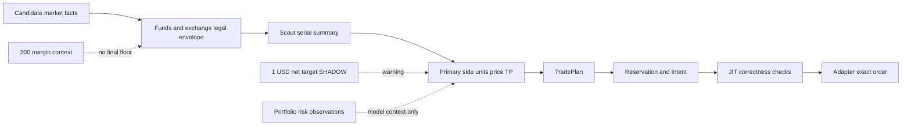

# V3.9.7 当前实例差异化优化实施计划

状态：`READY_FOR_REVIEW`。本计划只针对旧电脑上的当前 TESTNET 实例。代码基线为 GitHub `main` 的 `768c287`；审计开始时 Settings version 219，运行中的资产目录只读研究刷新使版本继续递增，业务交易参数未人工改动；环境为 `TESTNET / TESTNET_ENABLED`。最终运行 build/identity 在报告提交前的 readback 中固化。Astra 摘要只作为代码假设目录，下面的运行数字均重新来自本机 SQLite、AI archive、订单/成交、readback 和自然运行事实。

本轮没有按本计划改变方向、sizing、最低金额、TP、Scout/Primary 职责或交易策略。追加的业务代码仅是 P5 执行正确性收尾：一次性补载全部缺失持仓行情，并阻止 TP ACK 与仓位关闭竞态重建 phantom position；它们不改变 Entry 策略。

## 1. 当前实例身份与证据边界

- 代码已从 GitHub `main` 同步；sourceHash=`550901f687a017ce60bca0944503b7e35e1beca5ea24c3c91860dd9310f13ea7`，artifactHash=`5a2bb882678a2ecbc8c20f1a0e38edc022be73e11a79932a3e89dced9fb7351d`，buildId=`3.9.6-5a2bb882678a2ecbc8c2`。
- Settings 219：`entryMarginUsd=200`、`baseMarginUsd=200`、`minMarginUsd=1`、`maxMarginPerPositionUsd=500`；`takeProfit.minNetProfitUsd=1`、`minNetProfitRoiPct=0.15%`、`tradeEconomics.admissionMode=SHADOW`、授权目标利润处置为 `WARN_AND_KEEP`。
- 本机最近 72h 的 483 条可配对 Scout→Primary 链显示 Scout 延迟 P50 11.17s、Primary P50 74.44s、串行 P50 85.76s。该数字只描述当前实例。
- 本机 484 条可解析 Primary PLACE 中，64 条与 15m/4h/1d 全一致，296 条仅与 15m 一致，21 条仅与 4h/1d 一致，103 条没有形成所选方向的主一致组。长窗口行情覆盖不足，不能把短窗均值当作稳定收益结论。
- 可成熟且有留存行情的目标样本仅 36 条，其中 4 条在模型期限内触达；其余 448 条未成熟或覆盖不足。`11.11%` 只能描述该小样本。
- TESTNET funds-only readback 已证明 Gross/Direction/Cluster/Human/position count/UNKNOWN/history 等组合风险为观察项，`bookAdmission=NOT_APPLICABLE` 且 `enforced=false`。真实余额、symbol filters、价量合法性、私有事实、幂等、环境隔离、授权时效和交易所可下单性仍是执行正确性约束。
- `adapter request` 的原始 wire bytes 没有历史留存；相关字段保持 `UNKNOWN`。USDC 不能在缺少带时间戳 FX 事实时自动等同 USD。

## 2. 当前实例与 Astra 参考差异矩阵

| 问题 | Astra 参考结论 | 当前实例证据 | 当前实例裁决 | 系统性代码问题 | 实例特有问题 |
|---|---|---|---|---|---|
| sizing authority | 需核实多个 authority 和极小量路径 | 逐层链显示 Primary raw `quantityUnits` 首次选出约 5 notional；normalized→TradePlan→intent→order 未见缩量 | `CONFIRMED_CURRENT_INSTANCE`：Primary 是实际权威，经济目标缺失 | 是 | 当前订单分布是本机特有 |
| 业务最低金额 | 需区分 margin/notional/exchange minimum | 两个 200 是保证金规划字段，未进入最终 order floor；真正硬下限是交易所 filter | `CONFIRMED_CURRENT_INSTANCE` | 是 | Settings 数值是本机事实 |
| size/TP/费用闭环 | 需核实是否同一经济事实 | $1 floor 为 SHADOW，授权 TP 可 WARN_AND_KEEP；小仓可对应几美分净收益或远目标 | `CONFIRMED_CURRENT_INSTANCE` | 是 | 具体设置和样本分布特有 |
| 低经济价值订单 | 需核实合法但低价值订单 | 多数约 5 notional 在 Primary raw 首次出现，生命周期固定成本与大仓近似 | `CONFIRMED_CURRENT_INSTANCE` | 是 | 数量比例特有 |
| 1D/4h/15m 方向合同 | 需核实是否只是 prompt | 三周期均进入 packet，但 15m 是 focus、4h/1d 是 context；无机器可验证的一致性授权 | `CONFIRMED_CURRENT_INSTANCE` | 是 | 四组样本数量特有 |
| 方向错与入场过时 | 需拆分模型与时延 | 串行 P50 85.76s 已证明；长窗 MFE/MAE 覆盖不足 | 时延 `CONFIRMED_CURRENT_INSTANCE`；损失占比 `UNKNOWN` | 是 | 时延分布特有 |
| 后验链 | 需链接 15m/1h/4h 结果 | 身份链可追溯，但行情留存导致 30m/60m 及目标触达覆盖稀疏 | `CONFIRMED_CURRENT_INSTANCE` | 是 | 覆盖程度特有 |
| TP 保护与经济性 | 需分开 | reduce-only 保护与 `TP_LOW_NET_TARGET_KEPT` 可同时存在 | `CONFIRMED_CURRENT_INSTANCE` | 是 | 当前 TP/持仓样本特有 |
| 平仓效率 | 需核实职责空白 | TP 主导；AI Exit 为 SHADOW，Review 未形成在线执行闭环；不能用 fill 片段比代替 cycle close rate | 结构问题 `CONFIRMED_CURRENT_INSTANCE`；各原因占比 `UNKNOWN` | 是 | 当前持仓年龄与结果特有 |
| 风险重复干预 | 需核实是否改 size/side | 程序 veto 已移除；组合事实仍进入模型 packet，可能形成认知干扰 | 程序 veto `NOT_REPRODUCED_CURRENT_INSTANCE`；认知干扰 `STRONG_EVIDENCE` | 输入分层是系统性问题 | 当前 readback 不应套用其他实例 |
| Scout 价值 | 需比较增益和延迟 | 483 条链全部继续 Primary；增益没有可归因实验，串行成本已量化 | 延迟 `CONFIRMED_CURRENT_INSTANCE`；质量增益 `UNKNOWN` | 是 | 延迟与请求数特有 |
| 部署身份 | 需独立核对 | 当前 source/artifact/build/settings 可闭合，最终验收另附 identity/readback | `NOT_REPRODUCED_CURRENT_INSTANCE` | 否 | 只属于具体部署状态 |

## 3. 当前实例重新排序的根因

1. **Entry 没有统一经济合同（PROVEN）**：Primary 同时给 side、units、price 和 TP，但业务 minimum、资金占比、费用后净收益、1h 可达空间没有共同约束和共同版本。
2. **合法下限被当成可接受规模（PROVEN + STRONG_EVIDENCE）**：模型面对宽合法区间时大量选最小 units，执行层忠实物化；问题不在 adapter 缩量。
3. **方向事实和执行时钟没有共同授权（PROVEN）**：高周期只是上下文，Scout+Primary 串行显著消耗 15m 触发寿命，JIT 主要验证执行事实而非重新证明市场论点。
4. **TP 经济性、可达性和 size 松耦合（PROVEN）**：SHADOW/WARN_AND_KEEP 允许低净目标，极小仓若追求绝对收益又会生成远 TP。
5. **退出与后验学习覆盖不足（PROVEN）**：主动退出未上线，成熟窗口和 MFE/MAE 留存不足，系统无法稳定区分方向、时机、目标和退出责任。

当前最影响科学 sizing 的根因是第一、二项；最影响方向质量的是第三项；最影响 TP/平仓效率的是第四、五项。没有证据支持把现有微小订单统一机械放大到 200，也没有证据支持反转全部 LONG/SHORT。

## 4. 当前权威链与目标权威链

目标是新增版本化 `EntryEconomicMandate`，由一个联合求解步骤选择方向、规模、目标和期限；后续层只验证并原样物化。合同应至少包含：

- `minimumInitialMarginQuote`、`minimumOrderNotionalQuote`、`exchangeMinimumNotionalQuote`，三者单位和来源独立；
- selected notional、units、leverage、required margin、可用资金上限、step/tick；
- 1D/4h/15m 封闭 K 线身份、趋势状态、冲突解释、15m 触发及失效条件；
- 双边费、滑点、funding/FX 覆盖、目标条件净收益、概率加权 expected net、1h 可达区间；
- facts hash、settings version、开始/完成/submit/fill 时钟、到期条件和 first divergence。

旧 `entryMarginUsd=200` 不应自动迁移为新业务 floor。先由产品明确 200 表示 minimum margin、target margin 还是资本预算，再做带 schema version 的显式迁移。

## 5. 分类实施计划

### P0：源码需要改——先闭合证据和时钟

1. 为所有 PLACE/WAIT/过期/取消样本持续保存 5m/15m/30m/60m/4h 的 high/low/count/gap，建立可重放的 MFE/MAE 和 target-hit 事实。
2. 保存 Candidate→Scout→Primary→mandate→intent→adapter→remote order/fill 的单一 trace；raw request/response 去密钥保存，缺失 wire facts 继续 UNKNOWN。
3. 将 Scout 移出同步必经路径做对照实验。Primary 直接读取同一份结构化事实；只有可证明的增益超过延迟成本才恢复同步依赖。
4. 提交前验证 market thesis 的 fact hash、价格区间和趋势状态。失效时结束旧 mandate 并重新分析，不自动翻向、不延长旧 TTL。

### P1：Settings 需要审核——建立经济合同

1. 新增独立、按 quote asset 定义的 minimum margin/notional 政策；USDT/USDC 分开，跨币值必须使用有时间戳的 FX。
2. 明确 minimum conditional net 与 probability-weighted expected net 的含义。未知 funding/FX/reachability 不补零。
3. 由程序生成从业务 minimum 到真实资金上限的有限候选前沿，每项同时计算 size、margin、费用、目标移动和 1h 可达覆盖；Primary 选择一项或 `NO_TRADE`。
4. reprice/rounding 后重新验证同一 mandate；后续层不得静默 clamp、放大、翻向或改 TP。

### P2：源码需要改——方向、TP 与退出共用合同

1. Primary 输出 `higherTimeframeThesis`、`tacticalTrigger`、`conflictResolution` 和反证条件。趋势一致性先作为可测特征，不立即升级为硬 gate。
2. Entry mandate 的 target range、horizon 和失效条件进入 physical position cycle。Dashboard 分开显示远端保护、经济满足、1h 可达、目标过期。
3. Review/AI Exit 先 SHADOW 记录 HOLD/REDUCE/EXIT/HANDOFF 反事实和费用；达到预注册样本标准后再审核是否 ENFORCE。HUMAN/HANDOFF 不自动转回 AI。

### P3：部署身份与只观察项

- 每次候选发布都要通过 source/artifact/build/settings/schema/production-zero-write 身份闭合；这次没有 deployment drift，无需为它改策略代码。
- Gross/Direction/Cluster/Stress/Human/position count/历史 UNKNOWN 保留在观察 API 和 Dashboard，移出 Primary 的核心经济输入；用属性测试保证这些值变化不会改变 TESTNET 的合法资金 envelope、side 或 units。
- 当前长窗收益、Scout 增益、confidence 与收益相关性仍需继续自然观察。未达到覆盖标准前保持 `UNKNOWN`，不制造订单补样本。

## 6. 验收与依赖

实施顺序为：证据留存与时钟 → Scout 对照 → schema/migration/readback → minimum/经济候选前沿 → 方向授权 → TP/退出 → UI。经济合同依赖产品对业务 minimum 的单位定义；方向策略升级依赖相同窗口的后验样本；主动退出 ENFORCE 依赖 owner、费用和周期守恒验收。

每阶段必须通过 targeted tests、全量 `npm run verify`、typecheck、formal build、S00、storage、schema roundtrip 和 diff check。TESTNET funds-only 属性测试需要证明：在余额和交易所事实不变时，任意改变 Gross/Direction/Cluster/Human/UNKNOWN/历史持仓，最终 permit 和合法 quantity envelope 不变。

最终 Definition of Done：

- 每个新 Entry 都能回答为何是该方向、数量、TP、期限以及费用后收益和 1h 可达依据；
- 业务 minimum、交易所 minimum 和保证金概念各有唯一字段，并在最终远端订单上读回验证；
- raw→remote 没有未授权的数量/方向/目标变化；变化必须产生新 mandate identity；
- 同窗口对照证明短时逆向、期限内目标触达和净经济结果改善；证据不足时只保留 SHADOW；
- TP 远端覆盖、physical cycle 守恒、terminal claim、重启幂等、identity 6/6 和 Production 零写入全部通过。

## 7. 当前结论

Astra 提出的 11 类代码假设中，当前实例确认了 sizing authority、业务 minimum 缺失、经济合同、方向/时效、后验覆盖、TP/退出和 Scout 延迟等系统问题；没有复现“组合风险仍在程序上 veto Entry”或“部署身份漂移”。Scout 的质量增益、方向错误与迟到执行各自造成的损失占比、长窗趋势一致性收益仍为 `UNKNOWN`。当前实例应先修证据与时效，再建立单一经济 mandate，之后才审核方向规则和主动退出。
