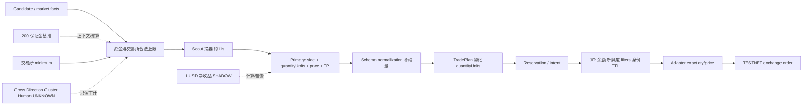

# V3.9.7 高质量建仓、仓位与净收益重新实施计划

状态：`READY_FOR_REVIEW`。审计代码基线为 GitHub `main` 提交 `768c287`；审计开始时 Settings version 219，运行中的资产目录只读研究刷新使版本继续递增，业务交易参数未人工改动；环境为 TESTNET / TESTNET_ENABLED。本文只提出后续实施方案；本轮没有按本文改变 sizing、方向、TP、最低金额、模型职责或风险策略。收尾追加的 P2/P5 修复只恢复周期与TP执行正确性，并修复订单十进制 wire 格式；它们不改变新 Entry 策略。

## 1. 当前事实基线与证据边界

### 已证明

- 当前 `portfolio.entryMarginUsd=200` 与 `portfolioIntelligence.baseMarginUsd=200` 都是保证金/资本规划字段；`portfolioIntelligence.minMarginUsd=1`。系统没有“每单至少 200 USDT notional”的执行合同。交易所 `minNotional/minQty` 才形成约 5、20、50 quote notional 的合法下限。
- Primary 是 qty、方向、入场价和 TP 的决策权威。自然链中 raw `quantityUnits` 经 normalized、TradePlan、reservation、intent、JIT 到 order 未见缩量或方向翻转；大量约 5 的订单在 Primary raw 首次出现。模型也曾选择约 903 notional，证明适配器没有统一 5 USDT 上限。
- Settings 的最低净收益是 `takeProfit.minNetProfitUsd=1`，另有 `minNetProfitRoiPct=0.15%`；并非提示中举例的 2 USDT。`tradeEconomics.admissionMode=SHADOW`，授权目标不足时 `authorizedTargetProfitFloorDisposition=WARN_AND_KEEP`，所以 1 USDT 主要是计算和告警事实，不是最终 Entry/TP 的统一硬合同。
- TESTNET funds-only 下 Gross/Direction/Cluster、position slot、Human exposure、risk admission、历史 UNKNOWN/claim 不再拥有 Entry veto；当前 readback 为 `bookAdmission=NOT_APPLICABLE/enforced=false`。实际执行边界仍保留真实余额、私有事实新鲜度、交易所 filters、合法价量、环境隔离、身份/幂等、授权 TTL、持久化和交易所可下单性。
- 组合和历史事实仍进入 packet/envelope/readback。代码虽明确要求模型不得把它们当方向或缩量依据，但模型 raw 理由曾引用 portfolio intelligence；因此“没有程序 veto”不等于“不会对模型形成认知干扰”。这类内容应从决策输入与审计输入中结构化分离。
- Entry prompt 稳定包含 1m/5m/15m/1h/4h/1d/1w；当前协议明确 15m 是 tactical focus，4h/1d 只是 context，没有 1D→4H→15m 的硬一致性合同。最近 72h 可解析的 484 个 Primary PLACE 中，64 个方向与 15m/4h/1d 全一致，296 个仅与 15m 一致，21 个仅与 4h/1d 一致，103 个三者均不形成所选方向的主一致组。
- Scout 当前启用并位于 Primary 前串行执行。最近 72h 有 483 个可配对链，全部向 Primary 传入 Scout facts；Scout 延迟中位 11.17s，Primary 74.44s，串行总耗时中位 85.76s、P90 89.72s、最大 96.06s。Scout 合同明确“不决定方向/订单”，它没有筛掉这些 Primary 调用；当前数据不能证明它提高方向命中、目标触达或净收益。
- 当前 Entry authorization `horizonMinutes` 只允许 1–5 分钟；TP horizon 是另一组 15/60 分钟等候选。系统没有一个统一的“未来约 1 小时可达空间”授权字段贯穿方向、规模、TP 和退出。最近可成熟且有行情覆盖的模型目标仅 36 个，4 个在目标期限内触达（11.11%）；覆盖仅为小样本，448 个样本为未成熟或行情留存不足，不能把 11.11%外推为真实总体触达率。
- 方向后验也受行情留存偏差影响。全周期一致组可观察 5m/15m 的均值为 +0.1769%/+0.2213%（n=12/11）；仅15m一致组为 +0.0099%/-0.0321%（n=51/45）。30m/60m覆盖过少，无法证明更高周期一致必然更优，但足以证明应把一致性作为可测特征，而不是用直觉直接做硬门。
- TP 保护覆盖与退出质量是不同问题。小 notional 乘正常百分比目标只能产生几美分；为满足固定净收益把极小仓位目标推远，又会降低触达并延长持有。AI Exit 仍为 SHADOW，position Review 未形成在线执行闭环，因此当前主要依赖 TP 自然触达。

### 尚不能证明

- 不能证明“所有 AI 方向都差”、高 confidence 必然更好、或简单反转 LONG/SHORT 会提高收益。
- 不能证明 Scout 的内容没有任何价值，只能证明它当前不筛选 Primary、增加串行时延，且缺少可归因的增益实验。
- 不能以稀疏 endpoint marks 计算完整 MFE/MAE，也不能用 Entry/Exit fill 片段比当同批周期平仓率。
- 不能把 USDC 默认等于 USD，也不能将历史缺失 funding/FX、wire request、周期边界补成 0 或 VERIFIED。

可重跑聚合与逐行样本见 [replan-audit.json](evidence/replan-audit.json)。核心交易质量的完整取证、20 条链路和历史边界见相邻的 `v397-core-trading-quality-final-audit-20260929` 报告与 evidence。

## 2. Astra 结论复核

| 建议 | 复核 | 新优先级与处理 |
|---|---|---|
| 慢推理、TTL、事件过期 | `PROVEN`。当前串行中位约85.8s，授权只剩很小余量；应区分 input/Scout/Primary/submit/fill 时钟 | P0。改为可量化的 freshness contract，并在提交前重评，不延长旧授权 |
| Scout 调度 | 串行开销 `PROVEN`；质量增益 `UNKNOWN`。Scout 不筛掉本批 Primary | P0实验。移出同步必经链，保留异步研究或只在异常事实触发；用随机/时间分块对照证明价值后再恢复 |
| 条件计划 | 方向正确，但不能把旧模型结论长期挂起 | P1。条件计划必须绑定事实 hash、价区、趋势状态和短 TTL，触发后用新事实重新授权 |
| AdmissionResult 统一 | 执行可解释性仍需要，但不应重新成为组合风险总门 | P1。统一返回“合法性/资金/身份/新鲜度/经济性观察”分类；TESTNET 组合风险只读 |
| 趋势退出 | 仍正确，AI Exit/Review 尚未形成充分在线闭环 | P1。先 SHADOW 证明收益/时效，再按 owner 和成本边界启用；不接管人工仓 |
| Gross/Direction/Cluster/position caps/portfolio risk | 作为观测仍有价值；作为 TESTNET Entry veto 或 sizing clamp 与当前目标冲突 | 保持无 veto；从模型经济决策输入中移到审计附录，防止认知污染 |
| 高杠杆/小仓位 | 现象存在，但“提高杠杆/放大订单”不是独立解法 | 纳入统一经济合同；杠杆只影响保证金和清算空间，不应替代方向/收益质量 |
| 当前无足够证据扩大仓位 | 仍然成立 | 先建立最小经济合同和质量分层；不把所有 5 USDT 单机械放大到 200 |

## 3. Top 根因排序

1. **缺少统一的 Entry 经济授权合同（PROVEN）**：方向、qty、TP、期限虽由模型一起输出，但 200 保证金、交易所 minimum、1 USDT 净收益、历史可达性和最终订单没有同一权威定义。SHADOW/WARN_AND_KEEP 允许经济不满足继续存在。
2. **模型被合法下限锚定，缺少资本配置目标（PROVEN + STRONG_EVIDENCE）**：envelope 强调最小/最大合法 units，Primary 几乎总选最小；输入没有要求在机会质量、净收益和一小时可达空间之间形成可审计的 selected notional。模型心理原因仍为推断。
3. **方向与时效没有共同合同（PROVEN）**：15m 是主关注但不是规则，高周期只是上下文；Scout+Primary 串行约86s，决策完成时的15m触发可能已经衰减。现有数据不能把方向错误和迟到执行可靠拆开。
4. **最低净收益、目标可达性与仓位规模彼此松耦合（PROVEN）**：最小量可通过“把目标放远”满足算术利润，统计可达性在 SHADOW 不阻断，TP 又允许 WARN_AND_KEEP；结果可能是低收益或长持有二选一。
5. **主动退出与后验学习闭环不足（PROVEN）**：TP覆盖良好不等于高质量退出；Review/AI Exit 没有在线 ENFORCE，且所有决策的长窗 MFE/MAE、未成交反事实和 lot级收益覆盖不足。

## 4. 当前权威链路

真正的 sizing authority 是 Primary 的 `quantityUnits`，执行层负责精确物化和合法性校验。当前缺项是“模型为何选这个 notional”的强合同；不是再加一个后置 `min()` 把订单改到200。

## 5. 新目标架构

### 5.1 `EntryEconomicMandate` 单一合同

新增版本化合同并贯穿 packet → raw → normalized → TradePlan → reservation → intent → JIT → adapter/readback：

- 身份：environment/account/settingsVersion/mandateId/runId/packetId/symbol/quote、facts hash、createdAt/expiresAt。
- 三种最低值分开：`minimumInitialMarginQuote`、`minimumOrderNotionalQuote`、`exchangeMinimumNotionalQuote`；每项有来源、单位和适用阶段。
- 规模：target/selected notional、quantityUnits、step、leverage、required margin、资金上限、最终价格范围。
- 质量：1D/4H/15m 状态与一致性、触发时刻、反例、信号有效期、方向结论。
- 经济：双边费、滑点、funding/FX覆盖、target conditional net profit、概率加权 expected net PnL（可为 UNKNOWN）、最小净收益、1h可达空间与样本覆盖。
- 解释：为什么是该方向、数量、TP、预计期限；原始选择与每层 first divergence。后续层只验证，不静默缩量、放大、翻向或改目标。

推荐将新的业务政策作为独立 Settings 提案审核，例如按 quote 定义 minimum margin/notional；不要从旧 `entryMarginUsd=200` 自动迁移。USDT/USDC 分别计价；若要求统一 USD，必须有带时间戳 FX 和缺失行为。

### 5.2 方向与时效

程序负责产生封闭 K 线、趋势特征和 freshness；模型负责方向判断。先把 1D/4H/15m 一致性作为特征和分层结果，不直接做 veto：

1. 记录每个周期的 barCloseTime/receivedAt/fact hash，以及 Primary 开始、结束、submit、fill 时刻。
2. Primary 必须显式输出 `higherTimeframeThesis`、`tacticalTrigger`、`conflictResolution` 和反证条件。
3. 提交前只验证事实是否仍在授权范围；变质则使旧授权失效并重新决策，不能自动反向或沿用旧方向。
4. 用同时间窗口比较全一致、仅15m、高周期一致但15m冲突、无一致四组的5m/15m/30m/60m MAE/MFE和净结果；样本达到预设置信区间后，才决定一致性是否升级为策略规则。

### 5.3 规模、最低净收益与一小时可达性联合求解

Primary 前提供有限但覆盖充分的候选前沿，而不是只突出 exchange minimum：每个候选包含 notional、margin、leverage、目标移动、目标条件净收益、历史1h触达覆盖和最大可达区间。候选必须覆盖业务 minimum 到真实可用资金上限，并显示不可行原因。

Primary 选择一个候选或 NO_TRADE，并给出 size rationale。不得用 confidence 直接线性放大，也不得为满足 1 USD 把极小单 TP 推到历史1h范围外。若没有同时满足资金、交易所合法性、业务最低值、净收益和可达性的组合，输出 NO_TRADE；不把订单偷偷改成最小量。

`minimum net profit` 需要明确是“目标条件净收益”还是“概率加权预期净收益”。建议两者都记录，只有前者不能证明经济质量。资金费/FX/可达概率未知时保持 UNKNOWN；经济策略可以拒绝 NO_TRADE，但必须与组合风险 veto 分开命名和展示。

### 5.4 Scout / Primary 重排

第一阶段将 Entry Scout 从同步必经路径移出：Primary 直接读取同一份结构化事实；Scout 保留外部事件研究、异常检测或异步预计算。做时间分块或随机对照，比较有/无 Scout 的 Primary 延迟、token、方向组表现、1h触达率和净收益。只有 Scout 提供了 Primary 原输入没有的新事实，且收益增益覆盖约11秒延迟，才允许回到关键路径；不得以“架构已有”作为保留理由。

### 5.5 退出闭环

Entry mandate 的 target、范围、期限和失效条件进入 position cycle。TP 继续提供灾备保护，但 Dashboard 分开显示“远端保护”“经济满足”“1h可达”“目标已过期”。Review 先在 SHADOW 验证 HOLD/REDUCE/EXIT/HANDOFF 的结果、owner、费用和时效；达到审核标准后才启用 AI Exit ENFORCE。历史 HUMAN/HANDOFF 不自动转成 AI_ACTIVE。

## 6. 风险与执行正确性的拆分

需要删除/降级：

- 从 Primary 的核心经济输入移除 Gross/Direction/Cluster/Stress、历史 claim、Human cap、position count 等组合策略内容；保留到审计附件和 Dashboard。
- 删除任何 TESTNET 下由 routed risk plan、admission ceiling、UNKNOWN 或持仓数量形成的隐藏 max qty/lease/side 拒绝；以属性测试证明它们改变只读事实时最终合法资金上限不变。
- 降级 `portfolioIntelligence` 的方向偏好和 exposure factor 为研究标签，不得出现在方向理由的权威字段。

必须保留：

- TESTNET/Production 隔离、真实 quote 可用余额及未提交承诺、private facts freshness、symbol filters、合法价量、杠杆档位、授权 TTL、idempotency/claim、持久化和交易所拒绝。
- 市场事实新鲜度与协议完整性。这些属于“无法形成合法当前订单”，需要与组合风险 reason 分组，不能伪装成 risk admission。
- 经济合同本身。它是交易选择质量，不是组合风险；拒绝时应显示 NO_ECONOMICALLY_FEASIBLE_PLAN，而不是 WAITING_EXECUTION_CAPACITY。

## 7. 数据、API 与 Dashboard

- 保存 raw request（去密钥）、raw response、normalized、candidate frontier、chosen mandate、final adapter request 和 remote order/fill；同一 identity 可逐字段比较。
- 所有 Entry，包括未成交、WAIT、REJECT、过期和取消，建立 5m/15m/30m/60m/4h/12h/24h observation；行情存储至少覆盖24h并保存每桶 high/low/count/gap，才能计算可靠 MFE/MAE。
- Dashboard 同行展示 Qty、Price、Order Notional、Initial Margin、Leverage、业务 minimum、exchange minimum、target conditional net、expected net、1h reach、趋势一致性、decision age。
- 关闭率用同批 physical cycle 生存分析；fill片段不当周期数。多 lot 周期只在有可证明分配时归因收益。
- API 将 `ExecutionCorrectnessResult`、`EconomicMandateResult`、`PortfolioObservation` 分开；只有第一类的资金/合法性/身份条件和经审核的第二类业务合同可阻止提交。

## 8. 实施顺序

1. 冻结基线和统计口径；保存 Settings、运行 identity、SQLite/WAL/SHM 与当前20条自然链。
2. 增加合同/schema/migration/readback，不改变行为；旧记录标记 `LEGACY_UNKNOWN`，不伪填200或净收益。
3. 补齐全决策行情与时钟留存，先解决后验覆盖偏差。
4. 将 Scout 移出同步必经链并做对照；建立 submit 前 freshness reauthorization。
5. 实现 minimum margin/notional/exchange minimum 三分合同和候选经济前沿；冻结模型选择，贯穿 adapter。
6. 接入1D/4H/15m可解释方向结构和1h可达性；先 SHADOW 分层，不立即硬编码方向规则。
7. 统一 TP/Review/Exit 与 Entry mandate；先 SHADOW，再按审核证据启用。
8. 完成 API/Dashboard、migration重放、故障恢复和历史兼容。
9. 跑 targeted/full tests、typecheck、formal build、`npm run verify`、S00、storage、schema、diff；普通 fast-forward push `main`。
10. 允许按既有 manual lifecycle 规则 stop/start/restart TESTNET，不需逐次申请；禁止 Production 写入、autostart/watchdog、制造订单/成交。最终要求 READY、identity 6/6、20条新build自然链以及成熟的后验观察窗口。

## 9. 测试与验证

- 单位/边界：保证金、notional、qty、leverage、USDT/USDC、tick/step、reprice 后业务 minimum。
- 不变性：raw side/units/target 与 plan/intent/JIT/request 完全相等；变化必须新 mandateId。
- TESTNET funds-only 属性测试：任意改变 Gross/Direction/Cluster/Human/UNKNOWN/历史持仓，只要余额与交易所事实不变，合法 qty 上下限和 permit 不变。
- 经济性：1 USD floor、ROI floor、费用、滑点、funding UNKNOWN、可达性不足、极小单远TP均产生正确 NO_TRADE 或明确 SHADOW 事实。
- 时效：Scout超时、Primary慢、价格越界、趋势事实变更、部分成交和取消竞态均不能复用旧授权。
- 后验：全部决策进入观察，覆盖缺口可见；filled/unfilled、LONG/SHORT、趋势组、confidence组的分母一致。
- 退出：TP保护、目标过期、Review、AI Exit、owner/handoff、周期账本守恒和重启幂等。

## 10. Definition of Done

- 所有新 Entry 都能回答方向、数量、TP、期限、费用后最低收益和1h可达依据；缺一项则没有可提交 mandate。
- 微小订单只能因明确业务 minimum 小于等于该值且经济合同成立而出现；不存在以交易所 minimum 充当业务目标的默认路径。
- 200 等设置的单位、范围和最终消费点唯一；Dashboard 与 adapter 读取同一合同。
- raw→remote 无缩量、放大、翻向、改TP；reprice 后重新验证业务 minimum、资金和授权范围。
- TESTNET 非资金组合风险对 candidate、Primary、PLACE、TradePlan、reservation、intent、submit 无 veto或隐形 clamp。
- 同时间分层数据证明新方案降低入场后短时逆向、提高目标期限内触达与净经济结果；若证据不足，保持 SHADOW，不宣布策略成功。
- 新周期账本守恒、TP远端覆盖、终态 claim、schema、identity、Production零写入全部通过。

## 11. 最终十问回答

1. 微小仓位来自 Primary 选择 exchange legal minimum；执行层未把大单缩成5。
2. 当前100不存在权威设置；两个200是保证金基准，不是最终订单notional floor，因此不会自动体现在订单金额。
3. Primary `quantityUnits` 是 sizing authority；后续当前样本保持原值。
4. 尚未闭环：1 USD floor存在，但经济 admission 为 SHADOW、授权TP可 WARN_AND_KEEP，且模型可以用远目标补小仓算术收益。
5. 1D/4H/15m都进入输入，但当前只由模型解释，15m是focus、高周期是context；不存在三周期一致的权威合同。
6. 两者都有可能。串行约86秒造成时效损耗已证明；按一致性分组的短窗结果不同，但覆盖不足以分配全部损失归因。
7. 小仓使绝对收益低；把固定净收益折算成远TP又降低触达。被动TP主导和主动退出未上线共同延长持有。
8. 系统有15/60分钟历史可达计算，但不是贯穿方向、规模、TP和退出的统一1h合同；真实成熟覆盖不足。
9. TESTNET 当前没有非资金风险程序 veto；仍需移除模型输入中的组合风险认知干扰，并用属性测试防止 routed plan/lease 别名回流。
10. 下一轮先修时钟和数据覆盖，再建立统一经济 mandate，随后联合方向/规模/TP，最后验证 Scout和主动退出；不再先扩风险系统。

## 12. 回退与证据保全

每阶段独立 commit，可普通 revert；禁止 force/rebase。migration 必须可重复执行并保留旧字段、raw archive、订单/fill和UNKNOWN。回退代码前先停止 TESTNET、复制数据库主文件及 WAL/SHM、实例身份和读回；回退不能覆盖期间真实成交。任何 Production credential/transport/data path 写入均为硬失败。
